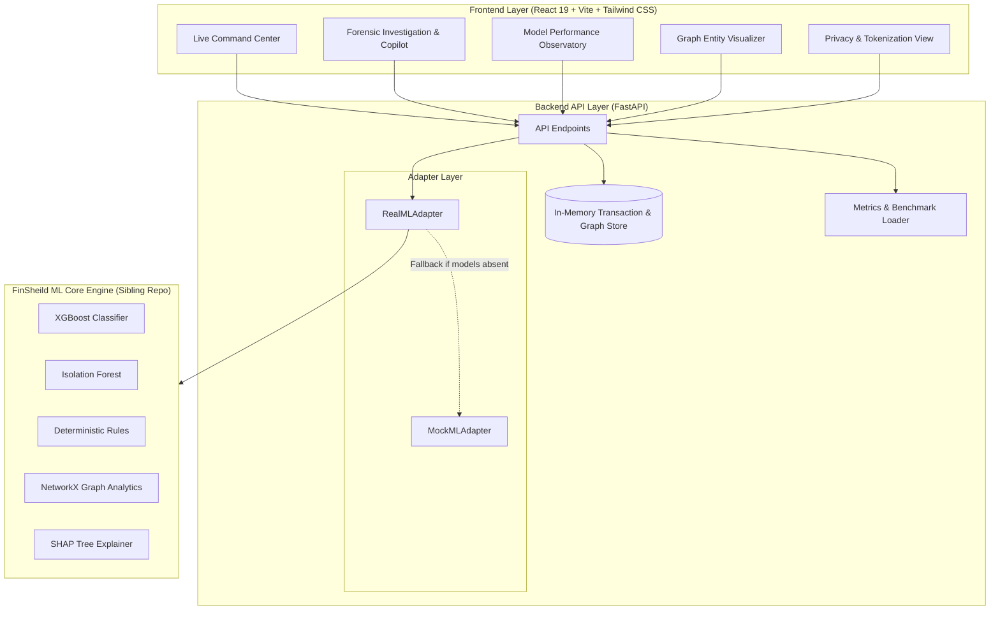

<div align="center">

# 🛡️ FinSheild App

### Real-Time Fraud Command Center & Explainability Forensics Copilot

[](https://react.dev/)
[](https://www.typescriptlang.org/)
[](https://vitejs.dev/)
[](https://tailwindcss.com/)
[](https://fastapi.tiangolo.com/)
[](https://python.org/)
[](LICENSE)

*The real-time operational interface and analyst workstation for the FinSheild fraud intelligence engine.*

[Live Tour](#-walkthrough--user-flows) • [Architecture](#-system-architecture) • [Quick Start](#-quick-start) • [API Reference](#-api-reference) • [ML Integration](#-integration-with-finsheild-core)

</div>

---

## 📖 Executive Summary

**FinSheild App** is the presentation and investigation layer of the FinSheild platform, developed for modern fraud risk teams and forensic investigators. While traditional fraud prevention systems operate as black-box decision engines with opaque block/allow lists, FinSheild provides:

1. **Instant Decisioning via 5-Signal Fusion**: Combines Supervised ML (XGBoost), Unsupervised Anomaly Scoring (Isolation Forest), Behavioral Drift, Network Graph Cliques, and Deterministic Rules.
2. **Explainable AI Forensics (XAI)**: Generates human-readable, grounded explanations with SHAP attribution so fraud analysts can immediately see *why* a transaction was flagged.
3. **Interactive Graph Forensics**: Visualizes entity associations (User ↔ Account ↔ Device ↔ Merchant) in real-time to pinpoint mule accounts and device-sharing fraud syndicates.
4. **Data Honesty by Design**: Transparent labels in the UI (`LIVE_MODEL` vs. `DEMO_FALLBACK`) ensure complete integrity during evaluation and demonstration.

---

## 🏛️ System Architecture



---

## 🚀 Key Features

### 1. Live Command Center
- Real-time transaction ingestion and scoring table with visual risk badges (`LOW`, `MEDIUM`, `HIGH`, `CRITICAL`).
- **Interactive Scenario Injector**: Trigger real-world fraud vectors on demand:
  - 🟢 **Normal**: Typical day-to-day benign transactions.
  - 🔴 **Account Takeover (ATO)**: Unusual amount + foreign location + new unverified device.
  - 🟠 **Velocity Abuse**: Burst transaction frequency exceeding rate limits.
  - 🟣 **Mule Network & Device Sharing**: One hardware fingerprint tied to multiple accounts.

### 2. 5-Signal Risk Fusion Breakdown
Every scored transaction displays its exact contribution breakdown:
- **XGBoost Probability** (35% weight)
- **Isolation Forest Anomaly Score** (20% weight)
- **Deterministic Rules Triggered** (20% weight)
- **Behavioral Drift Score** (15% weight)
- **Graph Centrality & Sharing Score** (10% weight)

### 3. Forensic Investigation Copilot
- Dedicated forensic workstation for analysts.
- **SHAP Feature Importance**: Shows exactly which features pushed the decision toward fraud (e.g., `amount_deviation_ratio`, `vel_count_300s`, `device_account_count`).
- **Investigation Copilot**: Produces a grounded narrative explaining the evidence without hallucination, suggesting recommended actions (`APPROVE`, `STEP_UP OTP`, `INVESTIGATE`, `BLOCK`).

### 4. Interactive Entity Graph Visualizer
- Maps relational graphs connecting `User`, `Account`, `Device`, and `Merchant`.
- Exposes device sharing rings and money mule paths that are completely invisible in tabular transaction rows.

### 5. Privacy & Identity Tokenization
- Shows how user PII is hashed, salted, and masked before entering model features to maintain strict privacy compliance.

---

## ⚡ Quick Start

### Prerequisites
- **Node.js** >= 18.0.0
- **Python** >= 3.11

### One-Command Launch (Recommended)
Clone the repository and run the unified launcher script:
```bash
./start.sh
```

This single command:
1. Detects your Python environment (local or sibling `.venv`).
2. Installs frontend dependencies if needed (`npm install`).
3. Launches the FastAPI backend daemon on `http://127.0.0.1:8000`.
4. Starts the Vite development server on `http://127.0.0.1:5173`.

---

### Manual Setup & Execution

#### Backend
```bash
# 1. Install dependencies
pip install -r requirements.txt

# 2. Set Python path and start server
export PYTHONPATH=.
python -m uvicorn backend.main:app --host 127.0.0.1 --port 8000 --reload
```
API Documentation will be live at: [http://127.0.0.1:8000/docs](http://127.0.0.1:8000/docs)

#### Frontend
```bash
cd frontend

# 1. Install packages
npm install

# 2. Start Vite dev server
npm run dev
```
Open [http://127.0.0.1:5173](http://127.0.0.1:5173) in your browser.

---

## 🔌 Integration with FinSheild Core

`Finsheild-App` is designed to be completely decoupled from the ML training repo:

1. **Auto-Discovery**: The backend looks for the ML Core at `../Finsheild`.
2. **Explicit Override**: You can define the path using an environment variable:
   ```bash
   export FINSHEILD_CORE_PATH="/path/to/Finsheild"
   ```
3. **Autonomous Mock Mode**: If the ML Core models or weights are not found, the backend automatically falls back to `MockMLAdapter` with honest `DEMO_FALLBACK` tags in the API response.

---

## 📡 API Reference

| Method | Endpoint | Description |
|---|---|---|
| `GET` | `/api/health` | Healthcheck and model readiness probe |
| `GET` | `/api/model/metrics` | Ingests real benchmark ROC/PR metrics |
| `GET` | `/api/model/status` | Reports presence of XGBoost, graph, SHAP, and fusion modules |
| `POST` | `/api/transaction/score` | Scores an arbitrary transaction payload |
| `POST` | `/api/transactions/generate` | Generates a scenario transaction (`normal`, `suspicious`, `fraud_ring`, `ambiguous`) |
| `GET` | `/api/transactions` | Lists recent scored transactions |
| `GET` | `/api/transactions/{id}` | Retrieves deep-dive transaction payload and scores |
| `POST` | `/api/investigation/explain` | Returns grounded copilot explanation and evidence |
| `GET` | `/api/graph/{id}` | Returns graph nodes and edges for visual forensic analysis |
| `GET` | `/api/identity/{id}` | Demonstrates tokenized and salted user identity |
| `POST` | `/api/demo/reset` | Clears simulator memory for fresh demonstration |

---

## 🧪 Testing

Run backend test suite:
```bash
PYTHONPATH=. pytest backend/tests/ -v
```

Run frontend build verification:
```bash
cd frontend && npm run build
```

---

## 📄 License

This project is licensed under the MIT License - see the [LICENSE](LICENSE) file for details.
